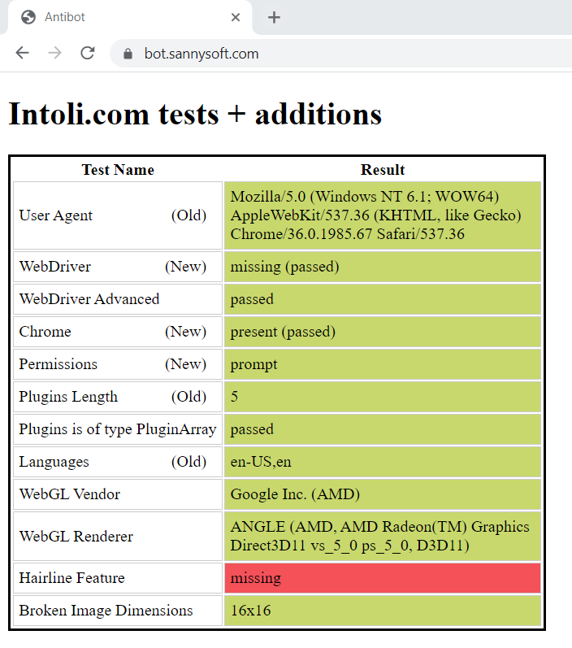
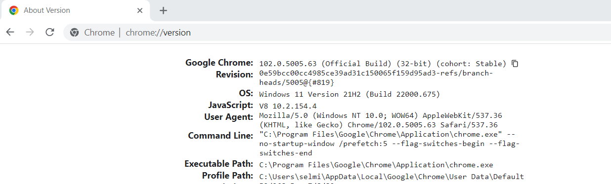

[**← BACK**](../../README.md)

# Create Undetectable Chrome Driver

easy-selenium will download and patch a Chrome driver to make it undetectable. So that you can use an undetectable Chrome driver for your Python Selenium code.

## Features:

- Download the exact chrome driver based on your OS and installed chrome version.

- Remove browser control flag

- Remove signature in javascript

- Set User-Agent

- Use maximum resolution

- Run Chrome driver on headless mode.

- Unmute the sounds of the browser.


## Passed the antibot test [](https://bot.sannysoft.com)



## Usage

```

from easy_selenium.driver.chrome.driver import Driver
driver = Driver()
chrome = driver.create()

chrome.get("https://selmi.tech")

```

## Options

**Load Profile**

Launch Chrome with its default or custom profile so that you can use cookies and site preferences from that profile.

```
chrome = driver.create_driver(profile="")
```

Note: Make sure to provide the absolute path of your profile and if the given profile folder doesn't exist, it'll be created.

To find path to your chrome profile data you need to type chrome://version/ into address bar . 



**Headless**

We can use a headless chrome browser to lower memory overhead and faster execution for the scripts that we write.

```
chrome = driver.create_driver(headless=False)
```
